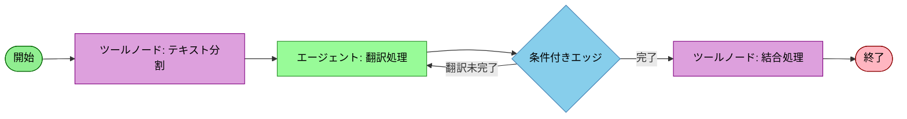

# LangGraph 長文翻訳AIエージェント

テキストを入力すると、記載されている英文を日本語に翻訳して出力するAIエージェントをLangGraphで実装する。
テキストは長文であるため、適切に章や段落ごとに分割して翻訳を行い、最終的に全ての翻訳文のパーツを結合して一つの翻訳済みテキストとして出力する。実装はLangGraphとする。

## 長文翻訳エージェントは以下の要素で構成されます：

- テキスト分割エージェント：長文を適切な単位に分割
- 翻訳エージェント：各セクションを日本語に翻訳
- 結合エージェント：翻訳された部分を統合
- 状態管理：分割されたテキストと翻訳結果の管理

## ワークフローの構造

- 緑色の四角（開始/終了）：ワークフローの開始点と終了点
- 紫色の四角（ツールノード）: LLMを使用せずにテキストの分割と結合を行う処理
- 薄い緑色の四角（エージェント）: LLMを使用して翻訳処理を行う処理
- 青色の菱形（条件付きエッジ）: 翻訳が完了したかどうかを判断
- 矢印は処理の流れを示しており、右側の条件付きエッジから左へ戻る矢印は、翻訳が完了するまでのループ処理を表しています
